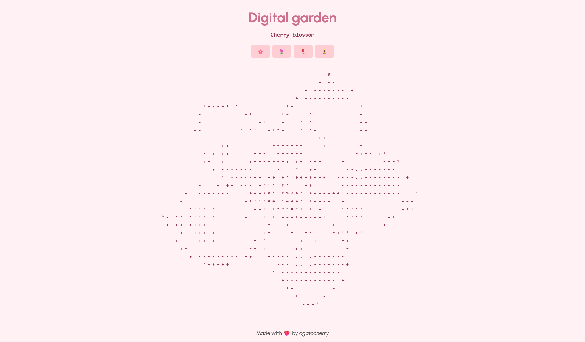
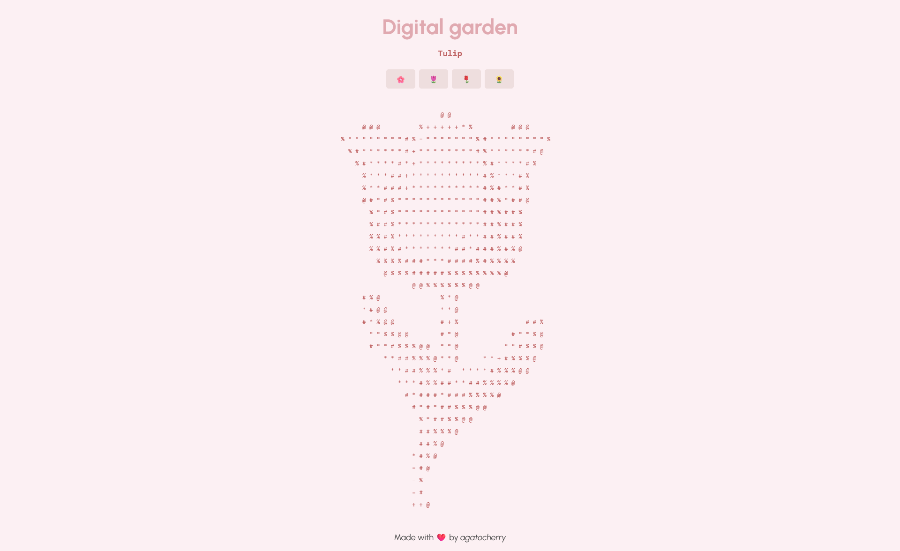
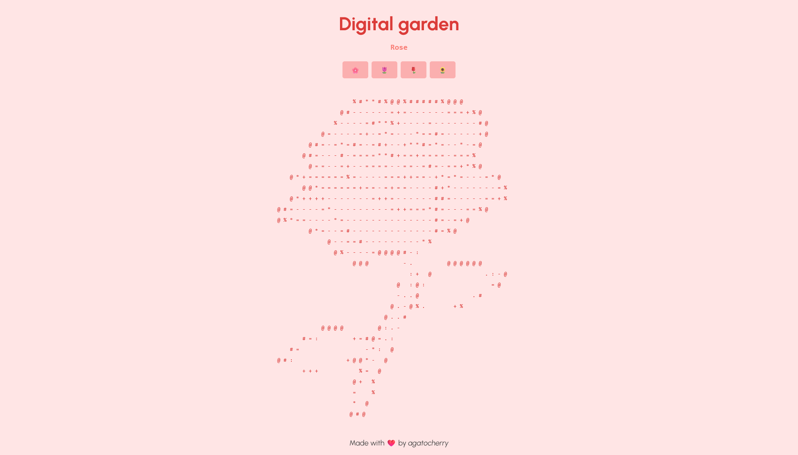
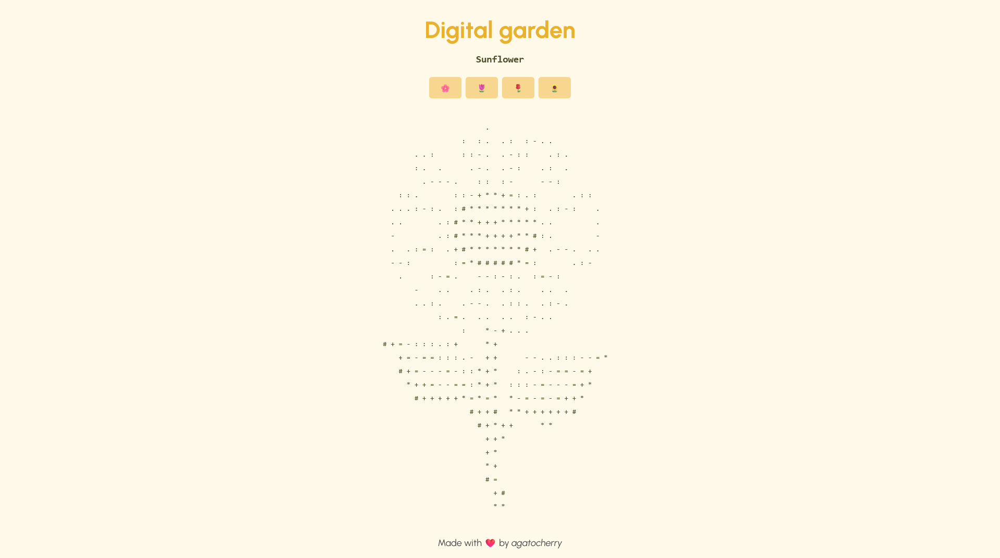

# Digital garden challenge 🪴

My project for the Codédex challenge of the month a digital garden ! 🌿

This is an ascii art digital garden, where you can navigate between the different plants : cherry blossom, tulip, sunflower and rose 🌸🌷🌻🌹.

# About the project 💻

Live demo : [https://digital-garden-challenge.vercel.app/](https://digital-garden-challenge.vercel.app/)